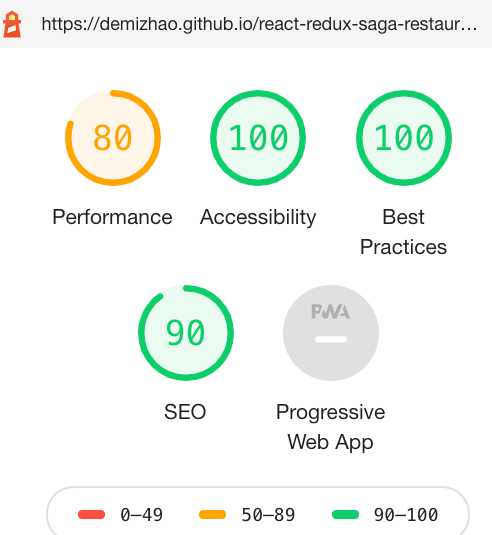
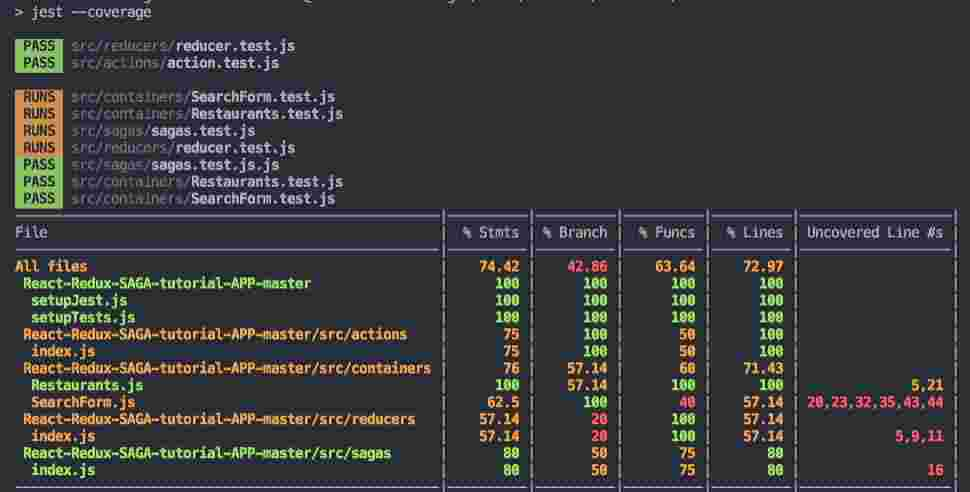

1. How long did you spend on the coding assignment? What would you add to your solution if you had more time? If you didn't spend much time on the coding test then use this as an opportunity to explain what you would add.
  * 8 hour
  * Validation, Error Handling, Style, i18n need improvement 

2. What was the most useful feature that was added to the latest version of your chosen language? Please include a snippet of code that shows how you've used it.
  * Redux Saga 
  * ``javascript
  function\* actionWatcher() {
  yield takeLatest('GET_RESTAURANTS', fetchRestaurants)
  }
  ``` 
3. How would you track down a performance issue in production? Have you ever had to do this?
  * Check Profiling, network, Bundle analyzer check if any bottle neck or unnecessary rerender etc; 
  * Not too much production support experience;

4. How would you improve the API that you just used?
  * API doesn't have information  such as Dinner/Lunch, Rating as requirement ;

5. Please describe yourself using JSON.
 

1. First ordered list item

2. Another item
  * Unordered sub-list. 

1. How long did you spend on the coding assignment? What would you add to your solution if you had more time? If you didn't spend much time on the coding test then use this as an opportunity to explain what you would add.
  *8 hour;
  *Validation, Error Handling, Style, i18n need improve;

What was the most useful feature that was added to the latest version of your chosen language? Please include a snippet of code that shows how you've used it.
  *Redux Saga;
  *```javascript
  function\* actionWatcher() {
  yield takeLatest('GET_RESTAURANTS', fetchRestaurants)
  }
  ```

*How would you track down a performance issue in production? Have you ever had to do this?
  *Check Profiling, network, Bundle analyzer check if any bottle neck or unnecessary rerender etc;
  *Not too much production support experience;

*How would you improve the API that you just used?
  *API doesn't have information  such as Dinner/Lunch, Rating as requirement ;

*Please describe yourself using JSON.
	```javascript
			{
			"name": "demi zhao",
			"email": "demi.y.zhao@gmail.com"
			"phone": "416-8361207",
			"git_url": "https://github.com/demiZhao",
			"linkin_url": "https://www.linkedin.com/in/demi-zhao-88a251b5/",
			"stack": ["Javascript","React","Redux", "NodeJS", "CSS"]
			}
		```
 






